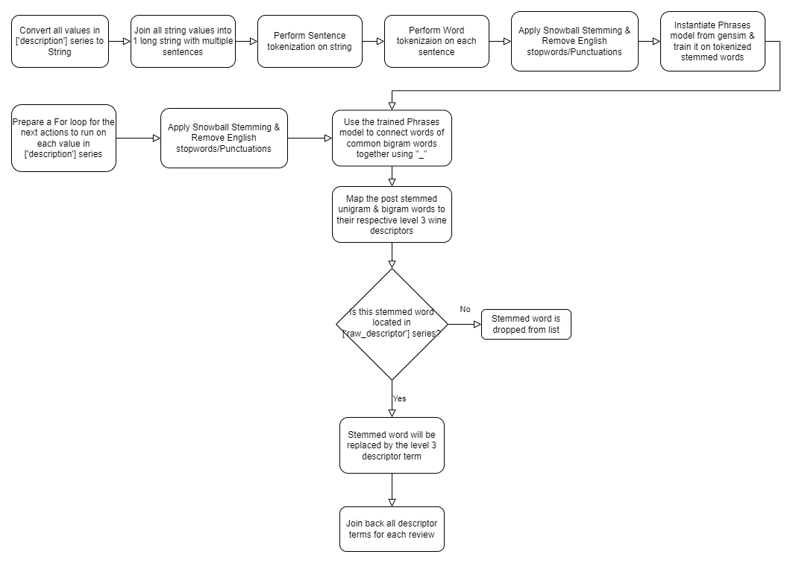

# Capstone Project: Wine Recommender
Author: Lee Wan Xian

---
## Executive Summary

The objective of this project is to create a recommender system for customers of a wine retail company. The tool is designed to mitigate the decision fatigue that they face regularly by suggesting 10 wines to choose from, instead of choosing from more than 10,000 wines. This report documents the steps taken to create a recommender system model that provides relevant wine recommendations based on the wine traits inputted by the customer. Wine traits for each wine are derived from their respective reviews and the standardized trait descriptions from RoboSomm Wine Wheels.

This report has 4 jupyter notebooks in total. 
* [Book 1](./code_recsys/capstone_book1.ipynb) covers Data Cleaning.
* [Book 2](./code_recsys/capstone_book2.ipynb) covers Exploratory Data Analysis, Preprocessing & Feature Engineering. 
* [Book 3](./code_recsys/capstone_book3.ipynb) covers Modeling, Conclusion & Recommendation. 
* [Deployment book](recsys_deploy_code.ipynb) covers the deployment code for Streamlit App.

This report shows that the best-performing recommender model is the k-NN Baseline model where maximum number of neighbors to account fro aggregation is 35 and cosine similarity measure is used. In conclusion, we recommend that the k-NN Baseline model should be used as the recommender system for this use case. 

Feel free to try out the wine recommender application [here](https://leewanxian-wine-recsys-app-app-v1pl1w.streamlit.app/).

---
## Problem Statement

Our client is in the wine retail business. Customers have informed them of decision fatigue when trying to choose from their huge catalogue of wines offered. To improve customer experience and engagement, they have tasked us to develop a wine recommender system that suggests a few suitable wines for their customers. In turn, this would alleviate the decision-making toil.

---
## Data Dictionary

### Wine reviews dataframe

Feature|Description
---|---
country|The country that the wine is from
description|The review given to the wine
designation|The vineyard within the winery where the grapes that made the wine are from
points|The number of points/ratings WineEnthusiast rated the wine on a scale of 1-100
price|The cost for a bottle of the wine
province|The province or state that the wine is from
region_1|The wine growing area in a province or state (i.e. Napa)
region_2|The specific region specified within a wine growing area (i.e. Rutherford inside the Napa Valley)
taster_name|Name of Wine taster
taster_twitter_handle|Wine taster's twitter handle
title|Name, Year & Vineyard of the wine. This feature is the key feature to differentiate wines from each other
variety|Type of wine (i.e. Pinot Noir)
winery|The place where the wine was made

### Wine traits descriptor mapping dataframe

Feature|Description
---|---
raw_descriptor|The raw descriptive terms used to describe a wine's traits
level_3|The 3rd level descriptive terms from RoboSomm wine wheels. This is the most detailed descriptive layer.
level_2|The 2nd level descriptive terms from RoboSomm wine wheels
level_1|The 1st level descriptive terms from RoboSomm wine wheels This is the most generic descriptive layer.

---
## EDA Summary

* Wines in the dataframe were made in either California, Washington, Oregon, or New York, with a majority coming from California. New York wines fared poorly, as compared to those from the other states.

* Most wine tasters gave similar ratings for wines that they reviewed with a majority lying within the 89 to 92 points range.

* There is a weak positive correlation (0.354) between the price and ratings of the wine. It would imply that even though the pricer the wine, the better the wine quality, it is not always the case. Notable outliers are wines that are priced above $300 but with relatively average ratings.

* Key wine traits words like `cherry`, `black pepper` or `french oak` have appeared in the top 25 words for both Count vectorization and TF-IDF vectorization. It implies that most wines in our database have such traits and the recommender system should not face issues when recommending 10 wines with such traits.

---
## Text Embeddings & Encoding of Wine Traits

Workflow as shown below  

---
## Model Evaluation

Model|Root Mean Squared Error (RMSE)|Precision@k
---|---|---
Pure Randomized Recommender (Baseline)|n/a|0.36
**KNN Baseline (Tuned)**|**1.828586**|**0.751706**
Baseline Predictor|1.921808|0.751706
KNN Basic|1.853119|0.751706
KNN Means|1.853373|0.751706
KNN ZScore|1.853372|0.751706
KNN Baseline|1.828589|0.751706
Slope One|1.853719|0.751706
Co-clustering|1.858452|0.749706
SVD|1.830108|0.659683
Normal Predictor|2.67958|0.605464
NonNegative Matrix Factorization|2.123324|0.582563

From the table above, the baseline model performed very poorly. With high volatility in its RMSE, the differences in its predicted rating to the actual rating for each taster-wine pair can fluctuate exponentially. It also has the lowest Precision@k score, which means it performs poorly in recommending the relevant wines in its top 10 recommendations.

The tuned k-NN Baseline with k=35 and cosine similarity measure performed the best out of all the models. Even though its Precision@k score is the same as six other models, it has the lowest RMSE score thus far. Thus, this model is very good at recommending relevant wines in its top 10 recommendations. Its predicted ratings are also much closer to the actual ratings for each taster-wine pair with a known label, compared to other models.

---
## Conclusion

**Recommendation System Model**

[k-NN Baseline](https://surprise.readthedocs.io/en/stable/knn_inspired.html#surprise.prediction_algorithms.knns.KNNBaseline) is the most suitable model to use for recommending wines. This model is capable of suggesting good quality wines better than leaving the recommendations by chance. 
Reasons are stated below:
1. Precision@k score is above 0.75 and higher than that of other models.
2. RMSE score is lowest amongst all other models.

**Limitation/Further Improvements**

A limitation of k-NN algorithm models is that they cannot handle higher dimensional data well. It implies that if the number of users or number of wines in the database increase, the chosen model might not perform well and end up giving poor recommendations. This leads to scalability issues for the client if they want to update the database. 

Our model is limited to the dataset used to train the recommender system. This is because the model can't recommend wines that are not available in the actual database in the first place. To add on, it is limited by the user reviews recorded in the dataset and any new users would not be able to update their actual ratings in the dataset. It would be good to update the ratings of new users in the database and retrain the recommender system from time to time. That way, our recommender system can stay relevant and continue to give good recommendations going forward. The recommender system can be further enhanced to exclude wines that have gone out of stock by linking the inventory data back to the dataset used by the recommender.

---
## Recommendation

Going back to the problem statement, we recommend that the k-NN Baseline model should be used as a recommender system to suggest suitable wines to customers.

---
## Streamlit App

[Streamlit App Link](https://leewanxian-wine-recsys-app-app-v1pl1w.streamlit.app/)

1. Users can select either one or more wine traits by typing in the dropdown list window. You can leave it empty if you choose to.
2. Click "Show me the wines!" to start the recommender

---
## Python Libraries

* Python = 3.8
* Pandas
* Numpy
* Matplotlib
* Seaborn
* Plotly
* Scikit-learn
* Scikit-Surprise
* Nltk
* Gensim
* Tqdm

---
## Credits

1. Wine Reviews, Kaggle. Zack Thoutt ([Link](https://www.kaggle.com/datasets/zynicide/wine-reviews)).
2. RoboSomm Wine Wheel Wine Descriptors, Github. Roald Schuring ([Link](https://github.com/RoaldSchuring/wine_recommender/blob/master/descriptor_mapping.csv)).
